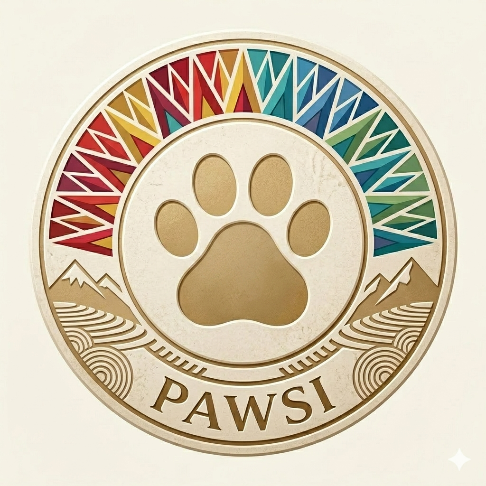

<div align="center">
  
  <br/><br/>
  <h1>Pawsi AI</h1>
  <p><strong>Plataforma de Gestión Inteligente de Salud Pública Animal</strong></p>
  <p><em>ONG Fucolla · Salta, Argentina · Puna Tech 2026</em></p>
  <br/>
  <p>
    
    
    
    
    
  </p>
</div>

---

## Campaña en la demo

La homepage lee `docs/data/base-datos-pawsi-la-caldera-2026-05-28.csv` al construir la página (61 filas, La Caldera, 28/05/2026, Convenio UCASAL). Conteos por tipo de mascota, nombres y aportes salen de ese archivo. La columna de teléfono no está en el CSV público.

Los aportes de la campaña son los gastos de medicamentos y descartables de las cirugías. Nada de ese monto es para el municipio ni para la universidad. Las intervenciones quirúrgicas las realizan estudiantes del último año de la carrera de Medicina de la universidad (Convenio UCASAL), en modalidad de prácticas profesionales, articuladas con FuCoLla y La Caldera.

| Indicador | Valor en la base |
|-----------|------------------|
| Perros | 28 |
| Gatos | 31 |
| Filas sin mascota | 2 |
| Aportes de la campaña (medicamentos y descartables) | $766.000 |
| Entidad gestora | Convenio UCASAL |

La tabla de aportes de la demo muestra esos montos en pesos. El ledger Stellar queda como capa ilustrativa y toma este total como contexto de la jornada.

---

## Stack Tecnológico

| Capa | Tecnología |
|------|-----------|
| **Frontend** | Next.js 15 + TypeScript + Tailwind CSS + shadcn/ui |
| **IA Predictiva** | Genkit + Google Gemini 2.5 Flash |
| **Datos Verificables** | Arkiv Network (Web3 database) |
| **Transparencia** | Stellar (XLM / USDC) |
| **Despliegue** | Firebase App Hosting / Vercel |

---

## Instalación y Ejecución Local

### Prerrequisitos
- Node.js 18+
- npm

### Pasos

```bash
# 1. Clonar el repositorio
git clone https://github.com/MaritoSAS/pawsi-ai.git
cd pawsi-ai

# 2. Instalar dependencias
npm install

# 3. Iniciar servidor de desarrollo
npm run dev
```

Abrir en el navegador: [http://localhost:9002](http://localhost:9002)

### Comandos adicionales

| Comando | Descripción |
|---------|-------------|
| `npm run dev` | Servidor de desarrollo (Turbopack, puerto 9002) |
| `npm run build` | Build de producción |
| `npm run lint` | Linter (Next.js ESLint) |
| `npm run typecheck` | TypeScript type checking |

---

## Equipo

3 integrantes — colaboradores del repositorio.

---

## Estructura del Proyecto

```
pawsi-ai/
├── public/                # Archivos estáticos (logos PNG)
├── docs/                  # Documentación del hackathon
│   ├── data/              # Datos reales de campaña (sin teléfonos)
│   ├── data/               # Base real La Caldera (sin teléfonos)
│   ├── pitch-deck-arkiv.md
│   ├── pitch-deck-stellar.md
│   ├── checklist-entrega.md
│   └── blueprint.md
├── src/
│   ├── app/               # App Router (páginas y layouts)
│   │   ├── page.tsx       # Página principal
│   │   ├── layout.tsx     # Layout raíz
│   │   └── globals.css    # Estilos globales
│   ├── ai/                # Flujos de IA (Genkit)
│   │   ├── genkit.ts
│   │   ├── dev.ts
│   │   └── flows/
│   ├── components/        # shadcn/ui components
│   │   └── ui/
│   ├── hooks/             # Custom hooks
│   └── lib/               # Utilidades
├── package.json
└── README.md
```

---

## Herramientas de IA Utilizadas

- **Claude** — Arquitectura, código, pitch
- **ChatGPT** — Ideas de producto
- **Genkit / Gemini 2.5 Flash** — Motor de IA predictiva
- **Cursor / OpenCode Go** — Edición asistida

---

## Enlaces Rápidos

| Recurso | Link |
|---------|------|
| 🌐 Demo en vivo | [pawsi-ai.vercel.app](https://pawsi-ai.vercel.app) |
| 📊 Pitch Deck Arkiv | [docs/pitch-deck-arkiv.md](docs/pitch-deck-arkiv.md) |
| 💡 Pitch Deck Stellar | [docs/pitch-deck-stellar.md](docs/pitch-deck-stellar.md) |
| ✅ Checklist de Entrega | [docs/checklist-entrega.md](docs/checklist-entrega.md) |
| 📁 Datos reales (La Caldera, 28/05/2026) | [docs/data/](docs/data/) |
| 🎬 Video demo | [`/demo-pawsi-ai.mp4`](public/demo-pawsi-ai.mp4) · [blob](https://github.com/MaritoSAS/pawsi-ai/blob/cursor/datos-reales-la-caldera-33a1/public/demo-pawsi-ai.mp4) · [raw](https://github.com/MaritoSAS/pawsi-ai/raw/cursor/datos-reales-la-caldera-33a1/public/demo-pawsi-ai.mp4) |
| 📝 Formulario Arkiv | [forms.arkiv.network/punatech26](https://forms.arkiv.network/punatech26) |
| 📝 Formulario Stellar | [form.typeform.com/to/eFquz55J](https://form.typeform.com/to/eFquz55J) |

---

<div align="center">
  <sub>Una alianza estratégica entre la <strong>ONG Fucolla</strong>, los <strong>Municipios de Salta</strong> y <strong>Arkiv Network</strong>.</sub>
  <br/>
  <sub>Desarrollado para la <strong>Hackathon Puna Tech</strong> · Salta, Argentina · 28–30 mayo 2026</sub>
</div>
